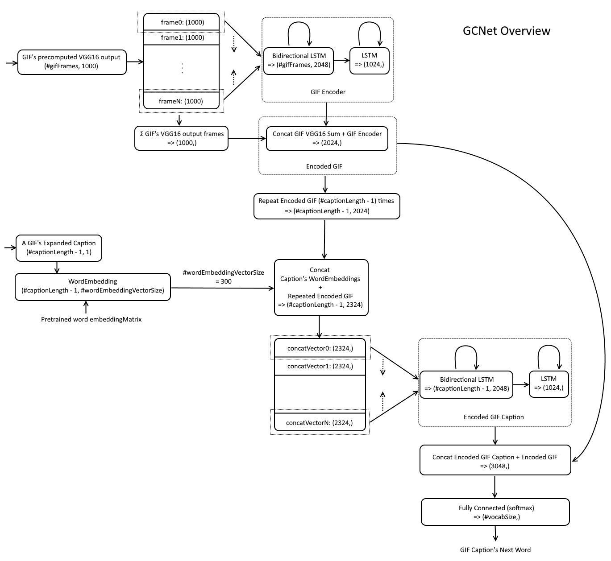
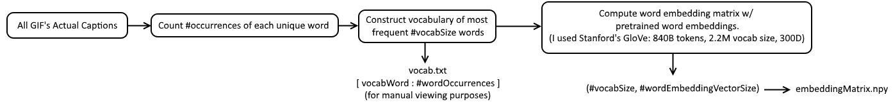
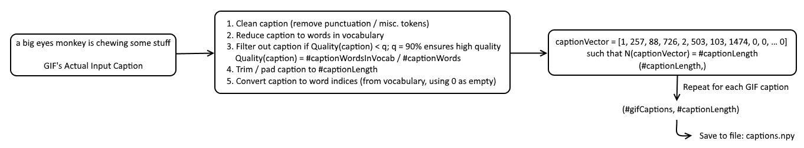
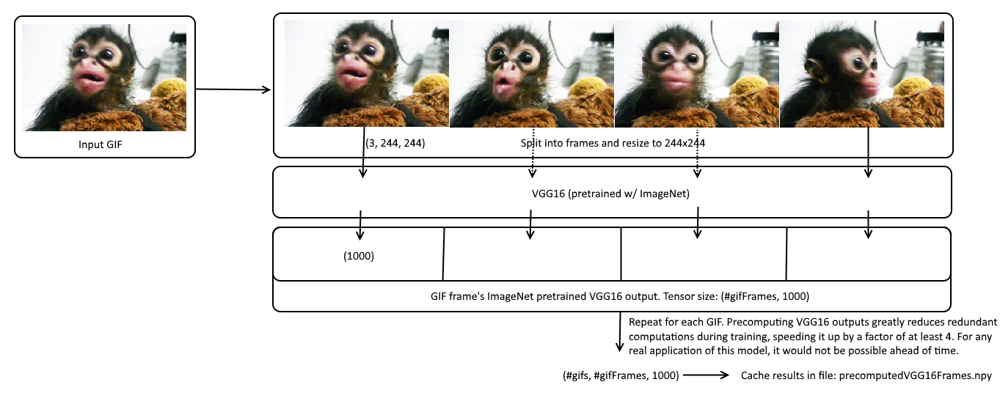
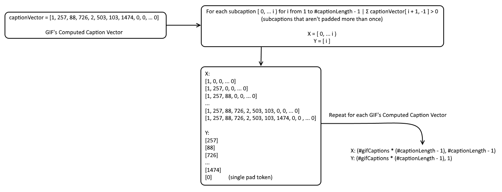

# GCNet (GIF Caption Network) | Neural Network Generated GIF Captions

## The goal of GCNet is to produce high quality GIF captions.

Below are GIFs from the [TGIF] dataset, and GCNet's generated captions for them. GCNet was not trained with these GIFs!

| GIF from [TGIF] Dataset | GCNet Generated GIF Caption |
|---|---|
|   | a monkey with an animal is eating something |
|   | a man is holding a microphone and moving his hands |
|   | a white car is driving down a road |
|   | a soccer player is scoring a goal in a football match |
|  | a dog is trying to catch a toy |
|  | a girl with blonde hair is talking and moving her head |
|  | a young woman in a car is driving and smiles |

# Architecture

## Input

1. GIF frames' precomputed VGG16 output ([TODO: Create Standalone GCNet that doesn't require precomputation](#standalone-gcnet))
2. In-progress GIF caption. This is a subcaption of the full caption (or the to be caption outside of training). See [Setup Step 7 - Data Expansion](#data-expansion). See [Obtaining a Caption with GCNet](#obtaining-a-caption-with-gcnet) for more details. 

## Output

1. Next word of the in-progress GIF caption. See [Obtaining a Caption with GCNet](#obtaining-a-caption-with-gcnet) for more details.


## Overview

GCNet can be thought of as computing: P(next word in caption | GIF, in-progress caption)



## Obtaining a Caption with GCNet

GCNet generates a GIF's caption iteratively, requiring the GIF and its in-progress caption to be run through GCNet the number of times there are words in the caption. This is because GCNet computes the next word given an input GIF and in-progress caption. The first iteration's in-progress caption will consist of empty word indices (all zeros), producing the first word in the caption. This word becomes part of the in-progress caption, and is fed back into GCNet along with the same GIF, producing the second word, and so on... until the in-progress caption is at the caption's max length - 1, producing the last word in the caption. This results in the in-progress caption becoming the final generated caption for the given GIF. 

1. For right now, all input needs to be precomputed. Steps to do this are in [Setup](#setup). 
2. For right now, once precomputed inputs are produced, use `gcnet.test.py` by changing the precomputed file references to your own.

([TODO: Standalone GCNet](#standalone-gcnet))

## Pretrained components

1. ImageNet Trained [VGG16]
2. Stanford's [GloVe] Word Vectors (840B tokens, 2.2M vocab, 300D)

# Setup

From start to finish, this will take at least 6 hours if you have a gigabit internet connection, fast processor, a lot of memory (at least 64GB), and a good GPU :)

## 0. Requirements

- [Keras]
- [Theano] / [TensorFlow] (as [Keras Backend])
- GPU (optional, but HIGHLY recommended)
- python 2.7 (recommended [Anaconda])
- [node.js] 6.9.1
- A dataset that follows the [data format described at the bottom](#data-format)


## 1. Provide Dataset

1. `mkdir data`
2. Place a dataset with the [Data Format](#data-format) requirements in `./data/gif-url-captions.tsv` 

OR, if you don't have your own dataset, you may choose to use this dataset ([TGIF], [Kaggle]), please review their license! Follow the below steps to proceed with this option.

1. `mkdir data`
2. `wget https://raw.githubusercontent.com/raingo/TGIF-Release/master/data/tgif-v1.0.tsv -O ./data/gif-url-captions.tsv`

## 2. Download
This will download all GIFs in the above dataset. If using [TGIF] as your dataset, this is ~120GB. Make sure you have enough room!

1. `mkdir gifs` 
2. `node download.js` 

- If you encounter errors while running this, increase `DOWNLOAD_INTERVAL` in `download.js`
- `download.js` will also strip out captions into `./captions.txt` for further processing

## 3. Prepare GIFs
This will split, resize, and save the resulting GIF frames such that for every GIF `./gifs/X.gif` with `N` frames, it will create frame PNGs `./gifs/X/X_[0..N].png`.

This doubles the size of the data, to ~250GB. If you would like to in place remove processed GIFs (keep size at ~120GB), then you must set `removeProcessedGifs = True` in `prepareGifs.py`

1. `python -i prepareGifs.py`

## 4. Clean Captions
This will attempt to normalize the captions by removing unneeded punctuation and expressions, saving them to `./clean.captions.txt`

1. `python -i cleanCaptions.py`

## 5. Filter Captions
`filterCaptions.py` will compute the vocab (and save to `vocab.#vocabSize.txt`), compute the embedding matrix (and save to `embeddingMatrix.#vocabSize.npy`), filter out captions that are low quality (default < 90% of words in caption are in vocab), and finally compute vocab indexed captions (and save to `dataY.captions.#captionLength.npy`)

1. `wget http://nlp.stanford.edu/data/glove.840B.300d.zip -O ./data/glove.840B.300d.zip`
2. `unzip ./data/glove.840B.300d.zip -d ./data/glove`
3. `python -i filterCaptions.py`




## 6. Precompute GIF frames' VGG16 output
Depending on your GPU, this step can take a while. On a GTX 1080, it takes about 3 hours using default settings (~1.65M images). Saves precomputed [VGG16] GIF frames to `precomputedVGG16Frames.#gifFrames.npy` (~6GB)

1. `python -i precomputeVGG16.py`



## 7. Running GCNet
If you changed any of the parameters in either step 5 or 6, then you will need to change the corresponding variables in `gcnet.train.py`

This will load all precomputed data, build GCNet, expand the data (see figure below), and start training.

1. `python -i gcnet.train.py`

### Data Expansion



There is an error in the above figure, it should include the empty subcaption (for i from 0 to #captionLength - 1): 

Prepending these to the example lists:

X: [0, 0, ... 0]

Y: [1]

## 8. Test Trained GCNet
If you changed any of the parameters in either step 5 or 6, then you will need to change the corresponding variables in `gcnet.test.py`

1. Set `PRETRAINED_WEIGHTS` in `gcnet.test.py` to the location of your trained weights file
2. `python -i gcnet.test.py`
3. Enjoy!

# Data Format
Provide a list of GIF urls and corresponding captions with the following data format:

Each new line will contain:

`gif-url	gif-caption` (such that `gif-url` and `gif-caption` are separated by a tab)

For example:

```
http://doggif.gif	a dog playing catch
http://catgif.gif	a cat walking around
```

Above are instructions for obtaining a dataset that meets this format. (GCNet does not require the above dataset as long as the aforementioned data format is followed)

# Acknowledged Issues

1. Some GIFs when split into their frames produce artifacts, distortions, or are otherwise not ideal. This is a bug with Pillow. I'm open to suggestions. I looked at many options, and they all seemed to have their pros and cons. I stuck with Pillow because it seemed to be no worse than other options, and is just easy to use with Python. 
2. Using the default 840B GloVe pretrained word vectors uses around 40GB of memory. To circumvent this, you may consider using one of GloVe's smaller pretrained word vectors. Otherwise, it is possible to change how word vectors are loaded, and be more efficient.
3. GCNet parameters are spread across files. These should be consolidated into a single config.
4. Sometimes the captions are just flat out wrong. This is typically because of #1. In the table above, those GIF's frames were split cleanly, and as you can tell, their resulting captions are just incredible. Otherwise, see [Future Work](#future-word) for details on how I plan to improve GCNet even more.
5. It's difficult to run a single GIF through GCNet to see what caption is produces. See [Standalone GCNet](#standalone-gcnet).

## Standalone GCNet

TODO: Create standalone `gcnet.py` that takes a GIF file name as input from the command line and prints out GCNet's generated caption for the GIF. It will also download pretrained GCNet weights. This should allow people to skip all [Setup](#setup) steps.

# Future Work

1. The most obvious improvement I can think of would be passing through the convolutional output from VGG16 (before its fully connected layers) for each frame, in addition to the currently used VGG16 output. This is because VGG16 was only trained with static categories, and may not have specialized in more useful indicators for the purpose of understanding contextual actions.
2. Curate a larger, more diverse, dataset. [TGIF] was great for a POC, but it is incredibly small (only ~100k GIFs). I'm looking forward to making a website that will allow people to submit GIFs w/ captions and allow the community to vote on the quality of other's submissions.
3. Make a website that allows users to upload / link a GIF, return GCNet's generated caption, and then vote on the generated caption's accuracy. This would not only be great for people to sample GCNet, it would also collect amazing data that could be used with reinforcement learning.

# WIP

This is a work in progress. If you notice something is wrong, please let me know, and I'll fix it when I get the chance! Thanks!

   [GloVe]: <http://nlp.stanford.edu/projects/glove/>
   [VGG16]: <https://arxiv.org/abs/1409.1556>
   [GIF Caption Dataset]: <https://arxiv.org/abs/1604.02748>
   [TGIF]: <https://github.com/raingo/TGIF-Release>
   [Anaconda]: <https://www.continuum.io/downloads>
   [Keras]: <https://keras.io/>
   [Keras Backend]: <https://keras.io/backend/>
   [Theano]: <http://deeplearning.net/software/theano/>
   [TensorFlow]: <https://www.tensorflow.org/>
   [node.js]: <https://nodejs.org/en/>
   [Kaggle]: <https://www.kaggle.com/raingo/tumblr-gif-description-dataset>